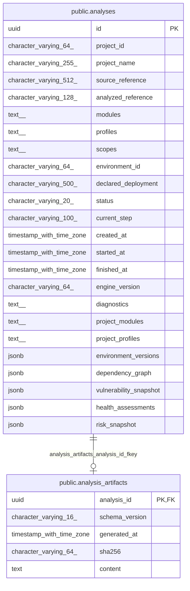
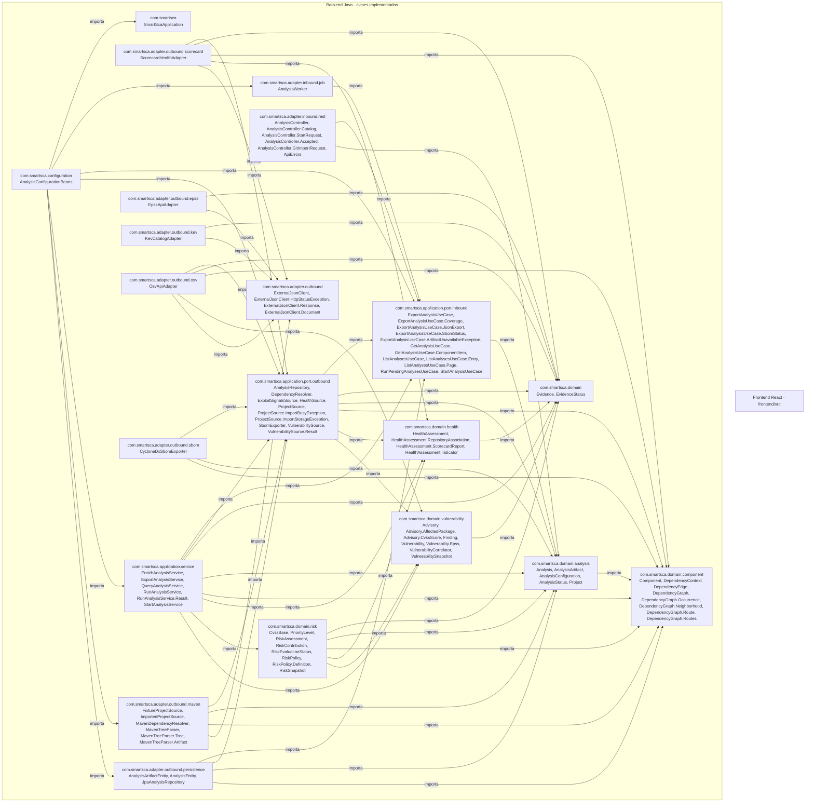
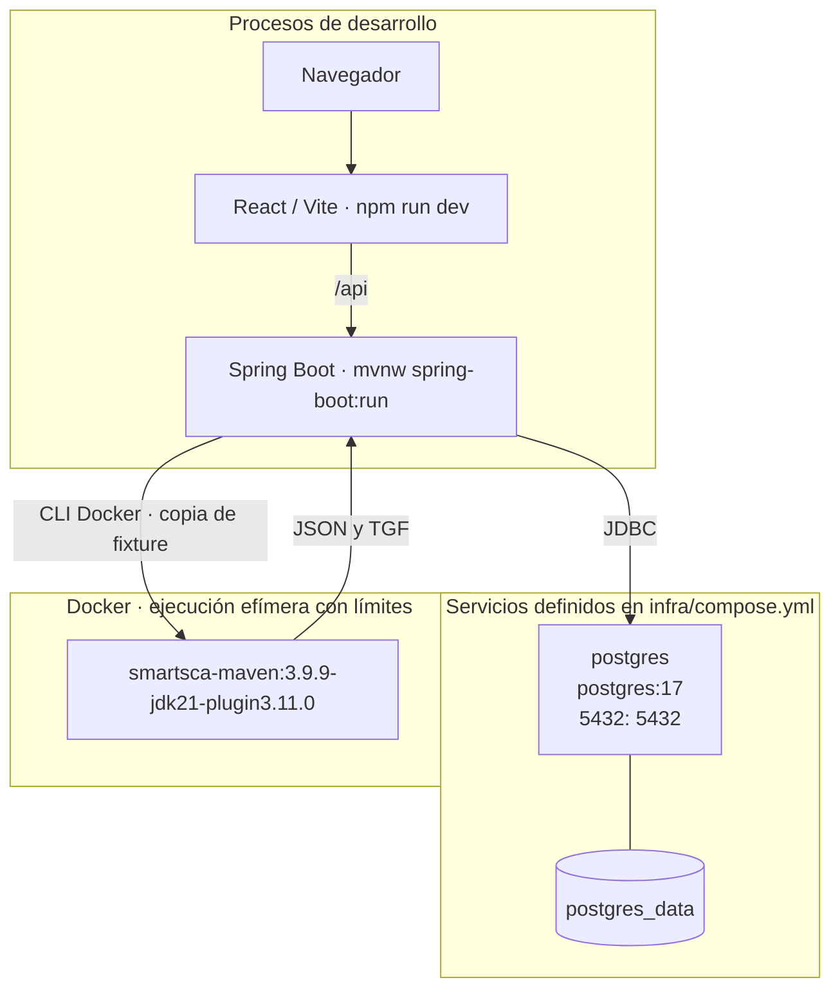

# SmartSCA

<!-- smartsca:generated:start -->
## SmartSCA — documentación generada

Generada desde declaraciones Java, migraciones aplicadas en PostgreSQL y Compose. El diseño previsto y los paquetes vacíos no se presentan como clases implementadas.

Para ejecutar: backend `cd backend && ./mvnw spring-boot:run`; frontend `cd frontend && npm ci && npm run dev`. PostgreSQL requiere `POSTGRES_PASSWORD` y `docker compose -f infra/compose.yml up -d`.

Antes de ejecutar análisis, construir el entorno aislado desde la raíz: `docker build -t smartsca-maven:3.9.9-jdk21-plugin3.11.0 infra/analysis`. Docker debe estar activo y accesible desde el backend.

Los comentarios Javadoc/TSDoc aportan las descripciones de clases, métodos y propiedades; sin comentarios se documentan las firmas disponibles.

### Diccionario de datos

### `public.analyses`

Solicitudes e instantáneas de análisis; el proyecto y la configuración se conservan tal como fueron registrados.

| Columna | Tipo | Nulo | Clave | Valor por defecto | Descripción |
|---|---|---|---|---|---|
| id | uuid | No | PK |  |  |
| project_id | character varying(64) | No |  |  | Identificador del catálogo, nunca una ruta proporcionada por el usuario. |
| project_name | character varying(255) | No |  |  |  |
| source_reference | character varying(512) | No |  |  |  |
| analyzed_reference | character varying(128) | No |  |  | Referencia registrada del POM; la resolución y la copia completa del proyecto se incorporan en el siguiente flujo. |
| modules | text[] | No |  |  |  |
| profiles | text[] | No |  |  |  |
| scopes | text[] | No |  |  |  |
| environment_id | character varying(64) | No |  |  |  |
| declared_deployment | character varying(500) | Sí |  |  | Contexto declarado por el usuario, no comprobado por el analizador. |
| status | character varying(20) | No |  |  | Estado persistido: EN_COLA, EN_EJECUCION, COMPLETO, PARCIAL o FALLIDO. |
| current_step | character varying(100) | No |  |  |  |
| created_at | timestamp with time zone | No |  |  |  |
| started_at | timestamp with time zone | Sí |  |  |  |
| finished_at | timestamp with time zone | Sí |  |  |  |
| engine_version | character varying(64) | No |  |  |  |
| diagnostics | text[] | No |  |  | Diagnósticos publicables; no deben contener secretos ni rutas internas. |
| project_modules | text[] | No |  | ARRAY[&#x27;.&#x27;::text] |  |
| project_profiles | text[] | No |  | ARRAY[]::text[] |  |
| environment_versions | jsonb | No |  | &#x27;{}&#x27;::jsonb | Versiones fijadas de imagen, JDK, Maven y plugin usadas en la resolución. |
| dependency_graph | jsonb | Sí |  |  | Instantánea de dependencias resueltas, raíces y relaciones con contexto. NULL significa no resuelto, no un inventario vacío. |
| vulnerability_snapshot | jsonb | Sí |  |  | Immutable OSV advisories, correlated findings, query coverage and per-CVE EPSS/KEV evidence; NULL before enrichment or for older analyses. |
| health_assessments | jsonb | Sí |  |  | RF-08 repository association evidence and published Scorecard checks by component purl; null for earlier analyses |
| risk_snapshot | jsonb | Sí |  |  | Política versionada y evaluaciones ordenadas con contribuciones/evidencias. NULL: análisis anterior o prioridad no evaluada; consultar no recalcula. |

### `public.analysis_artifacts`


| Columna | Tipo | Nulo | Clave | Valor por defecto | Descripción |
|---|---|---|---|---|---|
| analysis_id | uuid | No | PK, FK |  |  |
| schema_version | character varying(16) | No |  |  |  |
| generated_at | timestamp with time zone | No |  |  |  |
| sha256 | character varying(64) | No |  |  |  |
| content | text | No |  |  |  |

FK `analysis_artifacts_analysis_id_fkey`: `analysis_id` → `public.analyses (id)`.


### Diagrama de entidad relación



### Diagrama de clases Java

```mermaid
classDiagram
  class c0["com.smartsca.SmartScaApplication"] {
    +main(String[] args) void
  }
  class c1["com.smartsca.adapter.inbound.job.AnalysisWorker"] {
    -RunPendingAnalysesUseCase useCase
    -boolean ready
    +AnalysisWorker(RunPendingAnalysesUseCase useCase) 
    +recover() void
    +poll() void
  }
  class c2["com.smartsca.adapter.inbound.rest.AnalysisController"] {
    -StartAnalysisUseCase start
    -GetAnalysisUseCase query
    -ListAnalysesUseCase history
    -ExportAnalysisUseCase exports
    +AnalysisController(StartAnalysisUseCase start, GetAnalysisUseCase query, ListAnalysesUseCase history, ExportAnalysisUseCase exports) 
    +projects() Catalog
    +importZip(org.springframework.web.multipart.MultipartFile file) ResponseEntity~Project~
    +importGit(GitImportRequest request) ResponseEntity~Project~
    +register(StartRequest request) ResponseEntity~Accepted~
    +get(UUID id) Analysis
    +export(UUID id) ResponseEntity~ExportAnalysisUseCase.JsonExport~
    +sbomStatus(UUID id) ExportAnalysisUseCase.SbomStatus
    +sbom(UUID id) ResponseEntity~byte[]~
    +list(String projectId, AnalysisStatus status, int offset) ListAnalysesUseCase.Page
    +components(UUID id, String search, String module, String scope, Boolean direct) List~GetAnalysisUseCase.ComponentItem~
    +graph(UUID id, String module, String purl, int offset) com.smartsca.domain.component.DependencyGraph.Neighborhood
    +routes(UUID id, String purl, String module, int offset) com.smartsca.domain.component.DependencyGraph.Routes
  }
  class c3["com.smartsca.adapter.inbound.rest.AnalysisController.Catalog"] {
    <<record>>
    -List~Project~ projects
    -AnalysisConfiguration defaults
    -List~String~ scopes
  }
  class c4["com.smartsca.adapter.inbound.rest.AnalysisController.StartRequest"] {
    <<record>>
    -String projectId
    -AnalysisConfiguration configuration
  }
  class c5["com.smartsca.adapter.inbound.rest.AnalysisController.Accepted"] {
    <<record>>
    -UUID id
    -AnalysisStatus status
  }
  class c6["com.smartsca.adapter.inbound.rest.AnalysisController.GitImportRequest"] {
    <<record>>
    -String url
  }
  class c7["com.smartsca.adapter.inbound.rest.ApiErrors"] {
    ~importBusy(Exception error) ProblemDetail
    ~importStorage(Exception error) ProblemDetail
    ~oversized(Exception error) ProblemDetail
    ~multipart(Exception error) ProblemDetail
    ~artifactUnavailable(Exception error) ProblemDetail
    ~invalid(IllegalArgumentException error) ProblemDetail
    ~malformed(Exception error) ProblemDetail
    ~missing(NoSuchElementException error) ProblemDetail
    ~unavailable(DataAccessException error) ProblemDetail
    ~unexpected(Exception error) ProblemDetail
  }
  class c8["com.smartsca.adapter.outbound.ExternalJsonClient"] {
    -HttpClient client
    -JsonMapper json
    -Map~String, Document~ cache
    -boolean enabled
    +ExternalJsonClient(boolean enabled) 
    +deadline() long
    +request(URI uri, Object payload, long deadline) Response
    +document(URI uri, Object payload, long deadline) Document
    -limitedBody() HttpResponse.BodySubscriber~byte[]~
  }
  class c9["com.smartsca.adapter.outbound.ExternalJsonClient.HttpStatusException"] {
    -int statusCode
    -String location
    +HttpStatusException(int statusCode) 
    +HttpStatusException(int statusCode, String location) 
    +statusCode() int
    +location() String
  }
  class c10["com.smartsca.adapter.outbound.ExternalJsonClient.Response"] {
    <<record>>
    -JsonNode json
    -Instant collectedAt
  }
  class c11["com.smartsca.adapter.outbound.ExternalJsonClient.Document"] {
    <<record>>
    -byte[] bytes
    -Instant collectedAt
    +Document(byte[] bytes, Instant collectedAt) 
    +bytes() byte[]
  }
  class c12["com.smartsca.adapter.outbound.epss.EpssApiAdapter"] {
    -ExternalJsonClient http
    -URI endpoint
    +EpssApiAdapter(ExternalJsonClient http) 
    +EpssApiAdapter(ExternalJsonClient http, URI endpoint) 
    +lookup(Set~String~ cves) Map~String, Evidence~Epss~~
  }
  class c13["com.smartsca.adapter.outbound.kev.KevCatalogAdapter"] {
    -ExternalJsonClient http
    -List~URI~ endpoints
    +KevCatalogAdapter(ExternalJsonClient http) 
    +KevCatalogAdapter(ExternalJsonClient http, List~URI~ endpoints) 
    +lookup(Set~String~ cves) Map~String, Evidence~Boolean~~
  }
  class c14["com.smartsca.adapter.outbound.maven.FixtureProjectSource"] {
    -Path root
    +FixtureProjectSource(Path root) 
    +listProjects() List~Project~
    +validate(String id, AnalysisConfiguration configuration) Project
    +snapshot(Project expected, AnalysisConfiguration configuration, Path destination) void
    -folder(String id) Path
    -readProject(Path folder) Project
    -collect(Path root, String module, Set~String~ modules, Set~String~ profiles) void
    ~pom(Path path) Element
    ~pom(byte[] bytes) Element
    -files(Path folder) List~Path~
    -fingerprint(Path folder) String
    -children(Element parent, String name) List~Element~
    ~child(Element parent, String name) Element
    ~text(Element parent, String name) String
  }
  c42 <|.. c14
  class c15["com.smartsca.adapter.outbound.maven.ImportedProjectSource"] {
    -long MAX_ARCHIVE
    -long MAX_CONTENT
    -int MAX_ENTRIES
    -int MAX_PROJECTS
    -FixtureProjectSource fixtures
    -FixtureProjectSource imports
    -Path root
    -URI api
    -URI archives
    -Semaphore importing
    -JsonMapper json
    +ImportedProjectSource(Path fixtures, Path imports) 
    +ImportedProjectSource(Path fixtures, Path imports, URI api, URI archives) 
    -imported(String id) boolean
    -origin(Project project) Project
    +listProjects() List~Project~
    +validate(String id, AnalysisConfiguration configuration) Project
    +snapshot(Project expected, AnalysisConfiguration configuration, Path destination) void
    +importZip(InputStream input, String filename) Project
    +importGit(String url) Project
    +githubRepository(String value) String
    -importArchive(InputStream input, String source) Project
    -capacity() void
    -extract(Path archive, Path destination) void
    -validPath(String name) void
    -validateParents(Path project) void
    -findProject(Path content) Path
    -deletePending(Path path) void
  }
  c42 <|.. c15
  class c16["com.smartsca.adapter.outbound.maven.MavenDependencyResolver"] {
    +String IMAGE
    +Map~String, String~ VERSIONS
    -ProjectSource source
    -Duration timeout
    +MavenDependencyResolver(ProjectSource source, Duration timeout) 
    +resolve(Project project, AnalysisConfiguration configuration) DependencyGraph
    -capture(List~String~ args, Path archive) void
    ~command(List~String~ arguments, Duration timeout) String
  }
  c39 <|.. c16
  class c17["com.smartsca.adapter.outbound.maven.MavenTreeParser"] {
    +parse(Map~String, Tree~ trees, Set~String~ scopes) DependencyGraph
    -collect(JsonNode node, Map~String, Artifact~ resolved, int depth) void
    -artifact(JsonNode node) Artifact
    -walk(String id, String module, Map~String, Artifact~ nodes, Map~String, List~String~~ links, Map~String, Artifact~ resolved, Set~String~ scopes, Map~String, Component~ components, Set~DependencyEdge~ edges, Set~String~ visited, int depth) void
    -encode(String value) String
  }
  class c18["com.smartsca.adapter.outbound.maven.MavenTreeParser.Tree"] {
    <<record>>
    -String json
    -String tgf
  }
  class c19["com.smartsca.adapter.outbound.maven.MavenTreeParser.Artifact"] {
    <<record>>
    -String group
    -String name
    -String type
    -String classifier
    -String version
    -String scope
    ~key() String
    ~component() Component
  }
  class c20["com.smartsca.adapter.outbound.osv.OsvApiAdapter"] {
    -ExternalJsonClient http
    -URI endpoint
    +OsvApiAdapter(ExternalJsonClient http) 
    +OsvApiAdapter(ExternalJsonClient http, URI endpoint) 
    +lookup(List~Component~ components) Result
    -cvss(JsonNode values, String id, ExternalJsonClient.Response response) Evidence~List~Advisory.CvssScore~~
    -strings(JsonNode values) List~String~
    -readSeverity(JsonNode values, String id, List~Advisory.CvssScore~ result) boolean
    -version(JsonNode value) String
  }
  c46 <|.. c20
  class c21["com.smartsca.adapter.outbound.persistence.AnalysisArtifactEntity"] {
    ~UUID analysisId
    ~String schemaVersion
    ~Instant generatedAt
    ~String sha256
    ~String content
    #AnalysisArtifactEntity() 
    ~from(UUID id, AnalysisArtifact value) AnalysisArtifactEntity
    ~toDomain() AnalysisArtifact
  }
  class c22["com.smartsca.adapter.outbound.persistence.AnalysisEntity"] {
    ~UUID id
    ~String projectId
    ~String projectName
    ~String sourceReference
    ~String analyzedReference
    ~String[] modules
    ~String[] profiles
    ~String[] scopes
    ~String environmentId
    ~String declaredDeployment
    ~AnalysisStatus status
    ~String currentStep
    ~Instant createdAt
    ~Instant startedAt
    ~Instant finishedAt
    ~String engineVersion
    ~String[] diagnostics
    ~String[] projectModules
    ~String[] projectProfiles
    ~Map~String, String~ environmentVersions
    ~DependencyGraph dependencyGraph
    ~com.smartsca.domain.vulnerability.VulnerabilitySnapshot vulnerabilitySnapshot
    ~Map~String, com.smartsca.domain.health.HealthAssessment~ healthAssessments
    ~com.smartsca.domain.risk.RiskSnapshot riskSnapshot
    #AnalysisEntity() 
    ~from(Analysis analysis) AnalysisEntity
    ~toDomain() Analysis
  }
  class c23["com.smartsca.adapter.outbound.persistence.JpaAnalysisRepository"] {
    -EntityManager manager
    +JpaAnalysisRepository(EntityManager manager) 
    +save(Analysis analysis) void
    +get(UUID id) Optional~Analysis~
    +list(String projectId, AnalysisStatus status, int offset) ListAnalysesUseCase.Page
    +claimNextPending() Optional~Analysis~
    +updateStep(UUID id, String step) void
    +readSbom(UUID id) Optional~AnalysisArtifact~
    +finish(Analysis analysis) void
    +finish(Analysis analysis, AnalysisArtifact sbom) void
    +failInterrupted() void
  }
  c38 <|.. c23
  class c24["com.smartsca.adapter.outbound.sbom.CycloneDxSbomExporter"] {
    -JsonMapper json
    +generateAndValidate(Analysis analysis, DependencyGraph graph) AnalysisArtifact
    +validate(Analysis analysis, DependencyGraph graph, String content) void
    -document(Analysis analysis, DependencyGraph graph, Instant generatedAt) Map~String, Object~
    -property(String name, String value) Map~String, String~
  }
  c45 <|.. c24
  class c25["com.smartsca.adapter.outbound.scorecard.ScorecardHealthAdapter"] {
    -ExternalJsonClient http
    -URI metadata
    -URI central
    -URI gitbox
    +ScorecardHealthAdapter(ExternalJsonClient http) 
    +ScorecardHealthAdapter(ExternalJsonClient http, URI metadata, URI central) 
    +ScorecardHealthAdapter(ExternalJsonClient http, URI metadata, URI central, URI gitbox) 
    +assess(List~Component~ components) Map~String, HealthAssessment~
    -inspect(Component component, long deadline) HealthAssessment
    -gitboxMirror(String name, long deadline, List~Evidence~String~~ evidence) String
    -gitboxRepository(String value) String
    -publishedPoms(String groupId, String artifactId, String version, long deadline, List~Evidence~String~~ evidence, List~Element~ poms, Set~String~ seen) void
    -properties(Element pom) Map~String, String~
    -interpolate(String value, Map~String, String~ properties, Set~String~ profileProperties) String
    -absentReport(String purl, Evidence~RepositoryAssociation~ association, String source, Instant time, String date, EvidenceStatus status, List~Evidence~String~~ evidence, String reason) HealthAssessment
    -observation(String source, Instant time, String date, EvidenceStatus status, String reason) Evidence~T~
    -required(JsonNode node, String field) String
    -coordinate(String value) boolean
    -encode(String value) String
    -repository(String value) String
    -child(Element element, String name) Element
    -text(Element element, String name) String
    -unavailable(String purl, String source, Instant time, EvidenceStatus status, List~Evidence~String~~ evidence, String reason) HealthAssessment
    -size(HealthAssessment assessment) long
  }
  c41 <|.. c25
  class c26["com.smartsca.application.port.inbound.ExportAnalysisUseCase"] {
    <<interface>>
    ~downloadJson(UUID analysisId) JsonExport
    ~sbomStatus(UUID analysisId) SbomStatus
    ~downloadSbom(UUID analysisId) AnalysisArtifact
  }
  class c27["com.smartsca.application.port.inbound.ExportAnalysisUseCase.Coverage"] {
    <<record>>
    -Integer available
    -Integer total
  }
  class c28["com.smartsca.application.port.inbound.ExportAnalysisUseCase.JsonExport"] {
    <<record>>
    -String schemaVersion
    -Analysis analysis
    -List~String~ selectedComponentPurls
    -Map~String, Coverage~ coverage
    -List~String~ sectionsNotObtained
    -List~String~ limitations
  }
  class c29["com.smartsca.application.port.inbound.ExportAnalysisUseCase.SbomStatus"] {
    <<record>>
    -boolean available
    -String schemaVersion
    -Instant generatedAt
    -String sha256
    -String diagnostic
  }
  class c30["com.smartsca.application.port.inbound.ExportAnalysisUseCase.ArtifactUnavailableException"] {
    +ArtifactUnavailableException() 
  }
  class c31["com.smartsca.application.port.inbound.GetAnalysisUseCase"] {
    <<interface>>
    ~get(UUID analysisId) Analysis
    ~components(UUID analysisId, String search, String module, String scope, Boolean direct) java.util.List~ComponentItem~
    ~graph(UUID analysisId, String module, String purl, int offset) com.smartsca.domain.component.DependencyGraph.Neighborhood
    ~routes(UUID analysisId, String purl, String module, int offset) com.smartsca.domain.component.DependencyGraph.Routes
  }
  class c32["com.smartsca.application.port.inbound.GetAnalysisUseCase.ComponentItem"] {
    <<record>>
    -com.smartsca.domain.component.Component component
    -java.util.List~com.smartsca.domain.component.DependencyGraph.Occurrence~ contexts
  }
  class c33["com.smartsca.application.port.inbound.ListAnalysesUseCase"] {
    <<interface>>
    ~int PAGE_SIZE
    ~int MAX_OFFSET
    ~list(String projectId, AnalysisStatus status, int offset) Page
  }
  class c34["com.smartsca.application.port.inbound.ListAnalysesUseCase.Entry"] {
    <<record>>
    -UUID id
    -String projectId
    -String projectName
    -String sourceReference
    -String analyzedReference
    -AnalysisConfiguration configuration
    -AnalysisStatus status
    -Instant createdAt
    -Instant startedAt
    -Instant finishedAt
  }
  class c35["com.smartsca.application.port.inbound.ListAnalysesUseCase.Page"] {
    <<record>>
    -List~Entry~ items
    -int offset
    -Integer nextOffset
    -boolean navigationLimited
    +Page(List~Entry~ items, int offset, Integer nextOffset, boolean navigationLimited) 
  }
  class c36["com.smartsca.application.port.inbound.RunPendingAnalysesUseCase"] {
    <<interface>>
    ~runPending(int maxConcurrent) void
    ~failInterrupted() void
  }
  class c37["com.smartsca.application.port.inbound.StartAnalysisUseCase"] {
    <<interface>>
    ~listProjects() List~Project~
    ~start(String projectId, AnalysisConfiguration configuration) UUID
    ~importZip(InputStream input, String filename) Project
    ~importGit(String url) Project
  }
  class c38["com.smartsca.application.port.outbound.AnalysisRepository"] {
    <<interface>>
    ~save(Analysis analysis) void
    ~get(UUID analysisId) Optional~Analysis~
    ~list(String projectId, AnalysisStatus status, int offset) ListAnalysesUseCase.Page
    ~claimNextPending() Optional~Analysis~
    ~updateStep(UUID analysisId, String step) void
    ~finish(Analysis analysis) void
    ~finish(Analysis analysis, AnalysisArtifact sbom) void
    ~readSbom(UUID analysisId) Optional~AnalysisArtifact~
    ~failInterrupted() void
  }
  class c39["com.smartsca.application.port.outbound.DependencyResolver"] {
    <<interface>>
    ~resolve(Project project, AnalysisConfiguration configuration) DependencyGraph
  }
  class c40["com.smartsca.application.port.outbound.ExploitSignalsSource"] {
    <<interface>>
    ~epss(Set~String~ cves) Map~String, Evidence~Epss~~
    ~kev(Set~String~ cves) Map~String, Evidence~Boolean~~
  }
  class c41["com.smartsca.application.port.outbound.HealthSource"] {
    <<interface>>
    ~assess(List~Component~ components) Map~String, HealthAssessment~
  }
  class c42["com.smartsca.application.port.outbound.ProjectSource"] {
    <<interface>>
    ~listProjects() List~Project~
    ~validate(String projectId, AnalysisConfiguration configuration) Project
    ~snapshot(Project project, AnalysisConfiguration configuration, Path destination) void
    ~importZip(InputStream input, String filename) Project
    ~importGit(String url) Project
  }
  class c43["com.smartsca.application.port.outbound.ProjectSource.ImportBusyException"] {
    +ImportBusyException() 
  }
  class c44["com.smartsca.application.port.outbound.ProjectSource.ImportStorageException"] {
    +ImportStorageException() 
  }
  class c45["com.smartsca.application.port.outbound.SbomExporter"] {
    <<interface>>
    ~generateAndValidate(Analysis analysis, DependencyGraph graph) AnalysisArtifact
  }
  class c46["com.smartsca.application.port.outbound.VulnerabilitySource"] {
    <<interface>>
    ~lookup(List~Component~ components) Result
  }
  class c47["com.smartsca.application.port.outbound.VulnerabilitySource.Result"] {
    <<record>>
    -Map~String, Evidence~List~String~~~ queries
    -Map~String, Evidence~Advisory~~ advisories
    -Map~String, Set~String~~ identified
  }
  class c48["com.smartsca.application.service.EnrichAnalysisService"] {
    -VulnerabilitySource vulnerabilities
    -ExploitSignalsSource signals
    +EnrichAnalysisService(VulnerabilitySource vulnerabilities, ExploitSignalsSource signals) 
    +enrich(DependencyGraph graph, AnalysisConfiguration configuration) VulnerabilitySnapshot
    -observe(String source, Set~String~ ids, java.util.function.Supplier~Map~String, Evidence~T~~~ query) Map~String, Evidence~T~~
    -aggregate(String source, Map~String, Evidence~T~~ values, boolean complete) Evidence~Map~String, Evidence~T~~~
  }
  class c49["com.smartsca.application.service.ExportAnalysisService"] {
    -AnalysisRepository analyses
    +ExportAnalysisService(AnalysisRepository analyses) 
    +downloadJson(UUID id) JsonExport
    -available(Evidence~?~ evidence) boolean
    -saved(UUID id) Optional~AnalysisArtifact~
    +sbomStatus(UUID id) SbomStatus
    +downloadSbom(UUID id) AnalysisArtifact
  }
  c26 <|.. c49
  class c50["com.smartsca.application.service.QueryAnalysisService"] {
    -AnalysisRepository analyses
    +QueryAnalysisService(AnalysisRepository analyses) 
    +get(UUID id) Analysis
    +list(String projectId, AnalysisStatus status, int offset) Page
    -snapshot(UUID id) com.smartsca.domain.component.DependencyGraph
    +graph(UUID id, String module, String purl, int offset) com.smartsca.domain.component.DependencyGraph.Neighborhood
    +routes(UUID id, String purl, String module, int offset) com.smartsca.domain.component.DependencyGraph.Routes
    +components(UUID id, String search, String module, String scope, Boolean direct) java.util.List~ComponentItem~
  }
  c31 <|.. c50
  c33 <|.. c50
  class c51["com.smartsca.application.service.RunAnalysisService"] {
    -AnalysisRepository analyses
    -DependencyResolver resolver
    -EnrichAnalysisService enrichment
    -HealthSource healthSource
    -SbomExporter sbomExporter
    -ExecutorService executor
    -Semaphore slots
    -Map~String, String~ versions
    -Map~UUID, Result~ pendingResults
    +RunAnalysisService(AnalysisRepository analyses, DependencyResolver resolver, EnrichAnalysisService enrichment, HealthSource healthSource, SbomExporter sbomExporter, int concurrency, Map~String, String~ versions) 
    +runPending(int maxConcurrent) void
    -run(Analysis analysis) void
    -persistCompleted() void
    +failInterrupted() void
    +close() void
  }
  c36 <|.. c51
  class c52["com.smartsca.application.service.RunAnalysisService.Result"] {
    <<record>>
    -Analysis analysis
    -AnalysisArtifact sbom
  }
  class c53["com.smartsca.application.service.StartAnalysisService"] {
    -ProjectSource projects
    -AnalysisRepository analyses
    -String engineVersion
    +StartAnalysisService(ProjectSource projects, AnalysisRepository analyses, String engineVersion) 
    +listProjects() List~Project~
    +importZip(java.io.InputStream input, String filename) Project
    +importGit(String url) Project
    +start(String projectId, AnalysisConfiguration configuration) UUID
  }
  c37 <|.. c53
  class c54["com.smartsca.configuration.AnalysisConfigurationBeans"] {
    ~projects(String root, String imports) ProjectSource
    ~analyses(EntityManager manager) AnalysisRepository
    ~startAnalysis(ProjectSource projects, AnalysisRepository analyses) StartAnalysisUseCase
    ~queryAnalysis(AnalysisRepository analyses) QueryAnalysisService
    ~sbomExporter() SbomExporter
    ~exportAnalysis(AnalysisRepository analyses) ExportAnalysisUseCase
    ~dependencyResolver(ProjectSource projects, long seconds) DependencyResolver
    ~externalJson(boolean enabled) com.smartsca.adapter.outbound.ExternalJsonClient
    ~vulnerabilitySource(com.smartsca.adapter.outbound.ExternalJsonClient http) VulnerabilitySource
    ~exploitSignals(com.smartsca.adapter.outbound.ExternalJsonClient http) ExploitSignalsSource
    ~enrichment(VulnerabilitySource vulnerabilities, ExploitSignalsSource signals) EnrichAnalysisService
    ~healthSource(com.smartsca.adapter.outbound.ExternalJsonClient http) HealthSource
    ~runAnalysis(AnalysisRepository analyses, DependencyResolver resolver, EnrichAnalysisService enrichment, HealthSource health, SbomExporter sbom, int concurrency) RunAnalysisService
    ~worker(RunPendingAnalysesUseCase useCase) AnalysisWorker
  }
  class c55["com.smartsca.domain.Evidence"] {
    <<record>>
    -String source
    -Instant collectedAt
    -String sourceDate
    -EvidenceStatus status
    -T value
    -String diagnostic
    +Evidence(String source, Instant collectedAt, String sourceDate, EvidenceStatus status, T value, String diagnostic) 
    +copyValue(java.util.function.UnaryOperator~T~ copy) Evidence~T~
    +available(String source, Instant time, String date, T value) Evidence~T~
    +absent(String source, EvidenceStatus status, String reason) Evidence~T~
  }
  class c56["com.smartsca.domain.EvidenceStatus"] {
    <<enum>>
    +EvidenceStatus DISPONIBLE
    +EvidenceStatus NO_DISPONIBLE
    +EvidenceStatus NO_APLICABLE
    +EvidenceStatus ERROR
  }
  class c57["com.smartsca.domain.analysis.Analysis"] {
    <<record>>
    -UUID id
    -Project project
    -AnalysisConfiguration configuration
    -AnalysisStatus status
    -String currentStep
    -Instant createdAt
    -Instant startedAt
    -Instant finishedAt
    -String engineVersion
    -List~String~ diagnostics
    -Map~String, String~ environmentVersions
    -DependencyGraph dependencyGraph
    -com.smartsca.domain.vulnerability.VulnerabilitySnapshot vulnerabilitySnapshot
    -Map~String, com.smartsca.domain.health.HealthAssessment~ healthAssessments
    -com.smartsca.domain.risk.RiskSnapshot riskSnapshot
    +Analysis(UUID id, Project project, AnalysisConfiguration configuration, AnalysisStatus status, String currentStep, Instant createdAt, Instant startedAt, Instant finishedAt, String engineVersion, List~String~ diagnostics, Map~String, String~ environmentVersions, DependencyGraph dependencyGraph, com.smartsca.domain.vulnerability.VulnerabilitySnapshot vulnerabilitySnapshot, Map~String, com.smartsca.domain.health.HealthAssessment~ healthAssessments, com.smartsca.domain.risk.RiskSnapshot riskSnapshot) 
    +finished(AnalysisStatus state, String step, List~String~ messages, Map~String, String~ versions, DependencyGraph graph, com.smartsca.domain.vulnerability.VulnerabilitySnapshot vulnerabilities, Map~String, com.smartsca.domain.health.HealthAssessment~ health, com.smartsca.domain.risk.RiskSnapshot risk) Analysis
  }
  class c58["com.smartsca.domain.analysis.AnalysisArtifact"] {
    <<record>>
    -String schemaVersion
    -Instant generatedAt
    -String sha256
    -String content
    +int MAX_BYTES
    +AnalysisArtifact(String schemaVersion, Instant generatedAt, String sha256, String content) 
    +digest(String content) String
  }
  class c59["com.smartsca.domain.analysis.AnalysisConfiguration"] {
    <<record>>
    -Set~String~ modules
    -Set~String~ profiles
    -Set~String~ scopes
    -String environmentId
    -String declaredDeployment
    +Set~String~ SUPPORTED_SCOPES
    +AnalysisConfiguration(Set~String~ modules, Set~String~ profiles, Set~String~ scopes, String environmentId, String declaredDeployment) 
    -checked(Set~String~ values, boolean allowEmpty) Set~String~
    +defaults() AnalysisConfiguration
  }
  class c60["com.smartsca.domain.analysis.AnalysisStatus"] {
    <<enum>>
    +AnalysisStatus EN_COLA
    +AnalysisStatus EN_EJECUCION
    +AnalysisStatus COMPLETO
    +AnalysisStatus PARCIAL
    +AnalysisStatus FALLIDO
  }
  class c61["com.smartsca.domain.analysis.Project"] {
    <<record>>
    -String id
    -String name
    -String sourceReference
    -String analyzedReference
    -java.util.Set~String~ modules
    -java.util.Set~String~ profiles
    +Project(String id, String name, String sourceReference, String analyzedReference, java.util.Set~String~ modules, java.util.Set~String~ profiles) 
  }
  class c62["com.smartsca.domain.component.Component"] {
    <<record>>
    -String purl
    -String ecosystem
    -String name
    -String version
    -Map~String, String~ metadata
    +Component(String purl, String ecosystem, String name, String version, Map~String, String~ metadata) 
  }
  class c63["com.smartsca.domain.component.DependencyContext"] {
    <<record>>
    -String module
    -String originalScope
    -String normalizedContext
  }
  class c64["com.smartsca.domain.component.DependencyEdge"] {
    <<record>>
    -String parentPurl
    -String childPurl
    -DependencyContext context
  }
  class c65["com.smartsca.domain.component.DependencyGraph"] {
    <<record>>
    -Map~String, String~ rootsByModule
    -Map~String, Component~ components
    -Set~DependencyEdge~ edges
    +DependencyGraph(Map~String, String~ rootsByModule, Map~String, Component~ components, Set~DependencyEdge~ edges) 
    +contextsOf(String purl) Set~Occurrence~
    +contextsByComponent() Map~String, Set~Occurrence~~
    +componentsInScopes(Set~String~ scopes) List~Component~
    +neighborhood(String module, String purl, int offset) Neighborhood
    +routes(String purl, String module, int offset) Routes
    -requireComponent(String purl) void
    -Comparator~DependencyEdge~ EDGE_ORDER
  }
  class c66["com.smartsca.domain.component.DependencyGraph.Occurrence"] {
    <<record>>
    -String module
    -String scope
    -String originalScope
    -boolean direct
  }
  class c67["com.smartsca.domain.component.DependencyGraph.Neighborhood"] {
    <<record>>
    -String module
    -Component root
    -Component focus
    -List~Component~ neighbors
    -List~DependencyEdge~ edges
    -int offset
    -int totalNeighbors
    -Integer nextOffset
  }
  class c68["com.smartsca.domain.component.DependencyGraph.Route"] {
    <<record>>
    -String module
    -String rootPurl
    -List~DependencyEdge~ steps
  }
  class c69["com.smartsca.domain.component.DependencyGraph.Routes"] {
    <<record>>
    -List~Route~ routes
    -Map~String, Component~ components
    -int offset
    -Integer nextOffset
    -boolean searchLimited
  }
  class c70["com.smartsca.domain.health.HealthAssessment"] {
    <<record>>
    -String componentPurl
    -Evidence~RepositoryAssociation~ repository
    -Evidence~ScorecardReport~ scorecard
    -Map~String, Evidence~Indicator~~ indicators
    -List~Evidence~String~~ associationEvidence
    +List~String~ CHECKS
    +HealthAssessment(String componentPurl, Evidence~RepositoryAssociation~ repository, Evidence~ScorecardReport~ scorecard, Map~String, Evidence~Indicator~~ indicators, List~Evidence~String~~ associationEvidence) 
    +unavailable(String purl, String source, EvidenceStatus status, String reason) HealthAssessment
  }
  class c71["com.smartsca.domain.health.HealthAssessment.RepositoryAssociation"] {
    <<record>>
    -String id
    -String method
  }
  class c72["com.smartsca.domain.health.HealthAssessment.ScorecardReport"] {
    <<record>>
    -String repository
    -String repositoryCommit
    -String toolVersion
    -String toolCommit
    -boolean stale
    -String freshnessPolicy
  }
  class c73["com.smartsca.domain.health.HealthAssessment.Indicator"] {
    <<record>>
    -String name
    -int score
    -String reason
    -List~String~ details
    -String documentationUrl
    +Indicator(String name, int score, String reason, List~String~ details, String documentationUrl) 
  }
  class c74["com.smartsca.domain.risk.CvssBase"] {
    -Map~String, List~String~~ V2
    -Map~String, List~String~~ V3
    -Map~String, List~String~~ V4
    -allowed(String definition) Map~String, List~String~~
    ~score(CvssScore value) double
  }
  class c75["com.smartsca.domain.risk.PriorityLevel"] {
    <<enum>>
    +PriorityLevel CRITICA
    +PriorityLevel ALTA
    +PriorityLevel MEDIA
    +PriorityLevel BAJA
  }
  class c76["com.smartsca.domain.risk.RiskAssessment"] {
    <<record>>
    -Finding finding
    -String policyVersion
    -RiskEvaluationStatus status
    -Double score
    -PriorityLevel level
    -boolean knownExploited
    -List~RiskContribution~ contributions
    -List~String~ explanation
    -List~String~ limits
    +RiskAssessment(Finding finding, String policyVersion, RiskEvaluationStatus status, Double score, PriorityLevel level, boolean knownExploited, List~RiskContribution~ contributions, List~String~ explanation, List~String~ limits) 
  }
  class c77["com.smartsca.domain.risk.RiskContribution"] {
    <<record>>
    -String dimension
    -double weight
    -Double points
    -String rule
    -List~Evidence~String~~ usedEvidence
    +RiskContribution(String dimension, double weight, Double points, String rule, List~Evidence~String~~ usedEvidence) 
  }
  class c78["com.smartsca.domain.risk.RiskEvaluationStatus"] {
    <<enum>>
    +RiskEvaluationStatus EVALUADO
    +RiskEvaluationStatus PENDIENTE_REVISION
  }
  class c79["com.smartsca.domain.risk.RiskPolicy"] {
    +String VERSION
    +definition() Definition
    +evaluate(VulnerabilitySnapshot snapshot, DependencyGraph graph, AnalysisConfiguration configuration, Map~String, HealthAssessment~ health) RiskSnapshot
    +order() Comparator~RiskAssessment~
    -assess(Finding finding, Vulnerability vulnerability, Component component, Set~DependencyGraph.Occurrence~ contexts, AnalysisConfiguration config, HealthAssessment health, Evidence~List~String~~ query, Instant time) RiskAssessment
    -text(Evidence~?~ value) Evidence~String~
  }
  class c80["com.smartsca.domain.risk.RiskPolicy.Definition"] {
    <<record>>
    -String version
    -Map~String, Double~ weights
    -Map~String, Double~ thresholds
    -String formula
    -List~String~ missingEvidenceRules
    -List~String~ tieBreakRules
    -String cvssSelection
    -String calculator
    +Definition(String version, Map~String, Double~ weights, Map~String, Double~ thresholds, String formula, List~String~ missingEvidenceRules, List~String~ tieBreakRules, String cvssSelection, String calculator) 
  }
  class c81["com.smartsca.domain.risk.RiskSnapshot"] {
    <<record>>
    -RiskPolicy.Definition policy
    -Instant evaluatedAt
    -List~RiskAssessment~ assessments
    +RiskSnapshot(RiskPolicy.Definition policy, Instant evaluatedAt, List~RiskAssessment~ assessments) 
  }
  class c82["com.smartsca.domain.vulnerability.Advisory"] {
    <<record>>
    -String id
    -Set~String~ aliases
    -String summary
    -String description
    -List~String~ references
    -List~AffectedPackage~ affected
    -com.smartsca.domain.Evidence~List~CvssScore~~ cvss
    -String rawResponse
    +Advisory(String id, Set~String~ aliases, String summary, String description, List~String~ references, List~AffectedPackage~ affected, com.smartsca.domain.Evidence~List~CvssScore~~ cvss, String rawResponse) 
  }
  class c83["com.smartsca.domain.vulnerability.Advisory.AffectedPackage"] {
    <<record>>
    -String ecosystem
    -String name
    -String ranges
    -List~String~ versions
    -List~String~ fixedVersions
    -com.smartsca.domain.Evidence~List~CvssScore~~ cvss
    +AffectedPackage(String ecosystem, String name, String ranges, List~String~ versions, List~String~ fixedVersions, com.smartsca.domain.Evidence~List~CvssScore~~ cvss) 
  }
  class c84["com.smartsca.domain.vulnerability.Advisory.CvssScore"] {
    <<record>>
    -String version
    -String vector
    -String source
  }
  class c85["com.smartsca.domain.vulnerability.Finding"] {
    <<record>>
    -String componentPurl
    -String vulnerabilityId
  }
  class c86["com.smartsca.domain.vulnerability.Vulnerability"] {
    <<record>>
    -String id
    -Set~String~ aliases
    -Map~String, Evidence~Advisory~~ advisories
    -Evidence~Map~String, Evidence~Epss~~~ epssByCve
    -Evidence~Map~String, Evidence~Boolean~~~ kevByCve
    +Vulnerability(String id, Set~String~ aliases, Map~String, Evidence~Advisory~~ advisories, Evidence~Map~String, Evidence~Epss~~~ epssByCve, Evidence~Map~String, Evidence~Boolean~~~ kevByCve) 
  }
  class c87["com.smartsca.domain.vulnerability.Vulnerability.Epss"] {
    <<record>>
    -double probability
    -double percentile
    +Epss(double probability, double percentile) 
  }
  class c88["com.smartsca.domain.vulnerability.VulnerabilityCorrelator"] {
    -VulnerabilityCorrelator() 
    +correlate(Map~String, Evidence~Advisory~~ advisories) List~Set~String~~
  }
  class c89["com.smartsca.domain.vulnerability.VulnerabilitySnapshot"] {
    <<record>>
    -List~Finding~ findings
    -List~Vulnerability~ vulnerabilities
    -Map~String, Evidence~List~String~~~ componentQueries
    +VulnerabilitySnapshot(List~Finding~ findings, List~Vulnerability~ vulnerabilities, Map~String, Evidence~List~String~~~ componentQueries) 
  }
```

### Diagrama de componentes



### Diagrama de despliegue



Los componentes muestran dependencias por imports. El despliegue muestra procesos locales, servicios de Compose y el entorno Maven efímero.

### Automatizaciones

- `project-readme.yml`: actualiza únicamente este bloque después de cambios del proyecto; preserva el texto manual.
- `technical-pages.yml`: genera Javadoc (incluye miembros privados) y TypeDoc para el frontend, y publica en GitHub Pages.
- Ambos permiten ejecución manual desde **Actions**. Pages requiere **Settings → Pages → Source: GitHub Actions**, un plan compatible con repositorios privados y autorización de administración.
- El diccionario y ER proceden de migraciones Flyway, no de entidades de dominio. En CI se usa una base efímera; nunca la base de producción.
<!-- smartsca:generated:end -->
